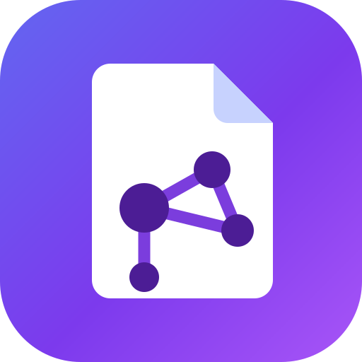

# Evernotian

Notionのような書き心地、Evernoteのような**PDF内文字検索**、Obsidianのような**第2の脳**を、
ひとつのローカルアプリにまとめたノートアプリです。

データはすべて手元のSQLiteとファイルに保存され、外部サービスは必要ありません。

<p align="center">
  
</p>

## できること

| | |
|---|---|
| **ブロックエディタ** | `/` でブロック挿入、ドラッグで並べ替え。見出し・リスト・ToDo・トグル・引用・コード（シンタックスハイライト付き）・テーブル・画像 |
| **PDFの全文検索** | PDFをドロップすると中の文字まで検索対象に。テキスト層が無いスキャンPDFは自動でOCR（日本語＋英語）。検索結果から該当ページへ直接ジャンプ |
| **リンクとグラフ** | `[[ノート名]]` で相互リンク。バックリンク一覧、未作成リンクの可視化、力学レイアウトのグラフビュー |
| **タグ** | 本文に `#タグ` と書くだけで集約。AIの提案をクリックで追加も可 |
| **ゴミ箱** | 削除したノートは元に戻せます（子ページごと） |
| **スマホ対応** | サイドバーはドロワーになり、検索もそのまま使えます |
| **AI（第2の脳）** | 自分のノートとPDFだけを根拠に答えるチャット（出典リンク付き）、自動タグ提案、要約、関連ノートの提示 |
| **Claudeと連携（MCP）** | 設定画面でトークンを発行すると、Claude Code / Claude Desktop から普段の会話の中でこのノートを検索・閲覧・作成できます |
| **日本語** | 2文字の検索語、全角/半角、大文字小文字をすべて吸収。𠮷野家のような追加漢字も検索可 |
| **意味検索** | ⌘Kで語が一致しなくても意味の近いノートを提示（APIキー不要・端末内で計算） |

## 必要なもの

- Node.js 22 以降
- Claude APIキー（**任意**。無くてもAIチャット以外は全て動きます）

## セットアップ

```bash
npm install
npm run dev      # http://localhost:3000
```

以上です。初回起動時に必要なものはアプリが自分で用意します。

- データベースの作成とマイグレーション
- 使い方を説明する最初のノート（不要なら消してください）
- OCRと意味検索のモデル（約170MB）のダウンロード（Dockerイメージには焼き込み済みなので、
  デプロイ版では起動時のダウンロードはありません）

モデルの取得はバックグラウンドで進み、**その間もノート作成・編集・検索は普通に使えます**。
進捗はサイドバーの下に出ます。ダウンロードに失敗しても他の機能は動き、次に使うときに再試行します。

オフラインの機械に入れる場合など、先にモデルを取っておきたいときだけ `npm run warmup` を使ってください。

### Claude APIキー（任意）

アプリの **設定** 画面から登録するか、`.env` に書きます。

```bash
cp .env.example .env
# ANTHROPIC_API_KEY=sk-ant-...
```

**キーが無くても以下はすべて動作します**: ノートの作成と編集、PDFの取り込みとOCR、
全文検索、リンクとバックリンク、グラフ、タグ、関連ノートの提示
（意味検索の埋め込みはこの端末の中で計算しているため）。
キーが要るのは、チャット・自動タグ・要約だけです。

## 日本語検索の仕組み

日本語は単語が空白で区切られないため、SQLite FTS5の標準トークナイザでは検索できません。

- `unicode61` は漢字の連なりを丸ごと1トークンとして扱う
- `trigram` は3文字窓で索引するため、**2文字の検索語に構造的に答えられない**
  （`予算`・`契約`・`会議` は日本語で最も多い検索語の形です）

そこでアプリ側でテキストを**重なり合うバイグラム**に分解して索引し、
検索語も同じ関数を通して**フレーズ**として問い合わせます。
FTS5の位置情報付きフレーズ照合が隣接を保証するので、結果として部分一致と同じ意味になります。

```
索引:  機械学習のモデルを東京で訓練した
    →  機械 械学 学習 習の のモ モデ デル ルを を東 東京 京で で訓 訓練 練し した

検索:  東京    → "東京"            ← trigramでは0件になるケース
       機械学習 → "機械 械学 学習"   ← フレーズで隣接を強制
       ＴＯＫＹＯ → "tokyo"         ← NFKC正規化で全角/半角を吸収
```

索引時と検索時で**必ず同じ正規化**（NFKC＋長さを保つ小文字化）を通します。
SQLiteの`unicode61`はNFKCを行わないため、これをJS側でやらないと
`ＴＯＫＹＯ` と `TOKYO` が別物になります。

n-gram検索の性質上、`京都` が `東京都` に一致するといった部分一致は起こります。
形態素解析（kuromoji等）を使えば避けられますが、辞書に無い固有名詞や専門用語が
**検索できなくなる**ほうが実害が大きいため、v1では採用していません。

## PDFの扱い

1. アップロードされたPDFは `data/files/` に保存され、キューに積まれます（応答は即座に返ります）
2. `pdf.js` でページごとにテキスト層を抽出
3. テキストがほとんど無いページ、または文字化けが多いページだけを画像化してOCR（`jpn+eng`）
4. ページ単位で検索索引に登録 — 解析済みのページから順に検索できるようになります

解析の途中でアプリを終了しても、次回起動時に自動で再開します。

> **重要**: `pdf.js` に `cMapUrl` / `cMapPacked` を渡さないと、Adobe-Japan1系の
> 日本語PDFは**エラーも出さずに**空文字や文字化けを返します。すると全ページがOCR送りになり、
> 「遅いのに検索できない」状態になります。この設定は `lib/pdf/extract.ts` にあり、
> スモークテストで恒久的に担保しています。

OCRは1ページあたり数秒かかります。進捗はエディタ内の添付ブロックに表示されます。

## コマンド

```bash
npm run dev        # 開発サーバー
npm run build      # 本番ビルド
npm start          # 本番サーバー
npm run typecheck  # 型チェック
npm run test       # 検索コアのユニットテスト（サーバー不要）
npm run warmup     # モデルを事前取得（任意。通常は初回起動時に自動で取得されます）
npm run testpdfs   # テスト用の日本語PDFを生成
npm run check-native # ネイティブモジュールが実際に読み込めるか確認
npm run smoke      # APIレベルのE2Eテスト（別ターミナルでサーバーを起動しておく）
npm run e2e        # ブラウザ操作のE2Eテスト（同上）
npm run icons      # assets/icon.svg からアイコン一式を生成
```

### スモークテスト

```bash
npm run testpdfs
EVERNOTION_DATA_DIR=./.tmp/smoke npm run build
EVERNOTION_DATA_DIR=./.tmp/smoke npx next start -p 3210 &
npm run smoke -- http://127.0.0.1:3210
npm run e2e   -- http://127.0.0.1:3210
```

`smoke` はAPI経由で、日本語の2文字検索、全角/半角の吸収、FTS5のクエリ構文のエスケープ、
PDFのテキスト抽出、スキャンPDFのOCR、ウィキリンクとバックリンク、そして
**APIキー無しでも他の機能が壊れないこと**を検証します
（ローカルで67項目、Googleログインを設定した環境では認証まわりを加えて75項目）。

`e2e` はヘッドレスChromiumで、`/` メニュー、`[[` 補完、自動保存、ドラッグハンドル、
⌘Kパレット、PDFビューアのテキストレイヤーとハイライト、スマホ幅でのドロワーと検索、
ゴミ箱の復元を検証します（27項目）。

`npm run test` はサーバー不要のユニットテストです（41項目）。日本語検索の中核
（正規化・バイグラム分割・クエリ組み立て・抜粋生成）を対象にしています。
クエリ組み立ては実際のFTS5テーブルに対して実行し、どんな入力でも構文エラーにならず、
演算子を注入されないことまで確認します。

デプロイまわりも同じスイートで見ています。ボリュームが本当にマウントされているかの判定、
書き込み可否の実測、セッション署名の偽造耐性、許可リストの判定、そして
**アカウント間でデータが漏れないこと**です。

最後のものは2種類あります。ひとつは実際に2人分のデータを作って、
Bさんが**AさんのページID・添付ID・ノート名・タグ名を知っている状態で**
読み・書き・削除・検索・グラフ・関連ノートを試す統合テスト。
もうひとつはソース走査で、所有者を持つテーブルに対するSQLが所有者で絞っていなければ落ちます。
後者は、タグ一覧ページが全アカウントのタグ名とノート抜粋を出していたのを実際に見つけました。
どちらもフィルタを1つ外すと落ちることを確認してあります。

いずれも**本番ビルドに対して**実行してください。`next dev` は下記の理由で
このテストには向きません。

## Evernote と Notion からのインポート

設定画面の「インポート」から、既存のノートを取り込めます。

| 元 | 書き出し方 | 渡すファイル |
|---|---|---|
| Evernote | ノートを選択 → 右クリック → 「ノートをエクスポート」 | `.enex` |
| Notion | 右上の `···` → Export → **Markdown & CSV** | `.zip` |

取り込まれるもの:

- **本文** — 見出し、箇条書き、チェックボックス、表、コードブロック、引用、書式
- **添付ファイル** — 画像は本文に埋め込まれ、**PDFは中の文字まで検索対象**になります
  （スキャンPDFはOCRにかかります。通常のアップロードとまったく同じ経路です）
- **Evernoteのタグ**
- **Notionのページ階層** — フォルダ構造がそのままノートの親子関係になります
- **Notionのページ間リンク** — `[[リンク]]` として繋がるので、
  取り込んだ直後からバックリンクとグラフが機能します
- **Notionのデータベース** — 1行が1ページになります（CSVは重複するので取り込みません）

1ファイル500MBまで。取り込みは裏で進み、進捗は設定画面に出ます。
PDFの解析は取り込み完了後も続くので、中身の検索が効くまで少し時間がかかります。

取り込んでいないもの: EvernoteやNotionのAPI連携（書き出しファイル経由のみ）、
HTML形式の書き出し、同じファイルを2回入れたときの重複検出。

## Claude と連携する（MCP）

アプリの中のAIとは**逆向き**の連携です。Claude Code や Claude Desktop での普段の会話の中から、
ここのノートを検索・閲覧し、新しいノートを作れるようになります。

設定画面の「Claude と連携」でアクセストークンを発行してください。
**トークンが表示されるのは発行した一度きり**です（保存しているのはハッシュだけなので、
DBからは復元できません）。無くしたら発行し直してください。

### Claude Code

設定画面に出るコマンドをそのまま実行します。

```bash
claude mcp add --transport http evernotian https://<あなたのアプリ>/api/mcp \
  --header "Authorization: Bearer evn_..."
```

以降、`/mcp` で接続を確認できます。

### Claude Desktop

Claude Desktop はリモートのMCPサーバに直接つながらないため、`mcp-remote` を挟みます。
`claude_desktop_config.json` に次を追記して、Claude Desktop を再起動してください。

```json
{
  "mcpServers": {
    "evernotian": {
      "command": "npx",
      "args": [
        "-y", "mcp-remote", "https://<あなたのアプリ>/api/mcp",
        "--header", "Authorization: Bearer evn_..."
      ]
    }
  }
}
```

設定ファイルの場所は macOS なら `~/Library/Application Support/Claude/`、
Windows なら `%APPDATA%\Claude\` です。

### Claude ができること

| ツール | 内容 |
|---|---|
| `search_notes` | キーワード検索。**日本語2文字でも引けて、PDFの中身も対象**です |
| `semantic_search` | 語が一致しなくても意味の近いノートを探します |
| `get_note` | 本文をMarkdownで読みます。タグ・リンク先・バックリンクも一緒に返します |
| `list_recent_notes` | 最近編集したノートの一覧 |
| `list_tags` | タグ一覧と件数 |
| `create_note` | Markdownで新しいノートを作ります。`[[ノート名]]` と書けばリンクになります |
| `append_to_note` | 既存ノートの**末尾に追記**します |

**既存ノートの上書きと削除はできません。** そういうツールを置いていないので、
Claude が誤って本文を消すことはありません。

### 気をつけること

- トークンはGoogleログインを**迂回する**経路です。発行して初めて有効になり、
  設定画面からいつでも失効させられます。失効させても「いつまで使われていたか」の記録は残ります
- トークン1本＝アカウント1つです。他人のノートには届きません
- ブラウザから来たリクエスト（`Origin` ヘッダ付き）は、このアプリ自身のURL以外は拒否します。
  Claude Code は `Origin` を送らないので影響ありません

## Railway へのデプロイ

デプロイに必要なものはリポジトリに入っています。**手で行う必要があるのは5つ**です
（6つめは任意）。

### 手動で必要なこと

| # | やること | 所要 |
|---|---|---|
| 1 | Railway のアカウントを作る（課金プランの選択を含む） | 数分 |
| 2 | GitHub リポジトリを接続してサービスを作る | 数クリック |
| 3 | **ボリュームを `/data` にマウントする** | 数クリック（CLIなら自動） |
| 4 | **公開ドメインを生成する** | 1クリック |
| 5 | **Googleログインを設定する**（下記） | 5〜10分 |
| 6 | （任意）`ANTHROPIC_API_KEY` を設定する | AI機能を使う場合のみ |

4 は見落としやすい手順です。デプロイ自体は成功しているのに URL が存在しない、という状態になります。
Railway のサービス画面 → **Settings → Networking → Generate Domain**、
または CLI で `railway domain` を実行してください。

### 設定ファイルについて（重要）

かつては `railway.toml` を置いていましたが、**削除しました**。Railway の Config as Code は
非推奨になり、既存ファイルは 2026-12-01 まで動くものの、
**新しく作るサービスはそもそも読み込まなくなった**ためです。
残しておくと、ヘルスチェックも再起動ポリシーもレプリカ数も*無言で無視*されます。

後継である Infrastructure as Code を `.railway/railway.ts` に置いてあります。
`railway.toml` と違い**ボリュームまで宣言できる**ので、CLI を使うなら上の表の 3 は自動化できます:

```bash
npx railway login
npx railway link          # プロジェクトを選ぶ
npx railway config plan   # 何が変わるか表示するだけ
npx railway config apply  # 適用する
npx railway domain        # 上の表の 4
```

**Git 連携のデプロイでは自動適用されません。** 上のコマンドを明示的に実行する必要があります。
ダッシュボードだけで進めたい場合は、`.railway/railway.ts` と同じ内容を画面で設定してください:

- **Volume**: マウント先 `/data`、2GB 程度
- **Healthcheck Path**: `/api/health`、タイムアウト 120 秒
- **Restart Policy**: On Failure、リトライ 3 回
- **Replicas**: 1

### ボリュームは必ず `/data` に

Railway のコンテナのファイルシステムは揮発性です。**ボリュームが無いと、デプロイや再起動のたびに
ノートとPDFがすべて消えます。**

忘れても起動はしますが、サイドバー下とサーバーログに警告が出続けます — 静かに壊れるのが
いちばん困るからです。容量はノートとPDFの量だけを見込めば足ります。モデルはイメージ側に
焼き込んであるので、ボリュームを消費しません。

なお Railway のボリュームは **root 所有でマウントされ、オーバーレイではありません**。
イメージ側でビルド時に `chown` しても、その上にマウントで被さるので効きません。
そのため `docker-entrypoint.sh` は root で起動し、**マウント後に**所有者を直してから
`setpriv` で uid 1001 に降格してサーバーを起動します。
公式に案内されている `RAILWAY_RUN_UID=0`（＝アプリを root で走らせる）を設定する必要はなく、
サーバープロセス自体も root のままにはなりません。

### Googleログインの設定

公開環境ではGoogleアカウントでログインします。**許可したメールアドレスだけ**が入れて、
**ノートとPDFはアカウントごとに完全に分離**されます。

1. [Google Cloud Console](https://console.cloud.google.com/apis/credentials) を開く
2. プロジェクトを作る（既存のものでも可）
3. **OAuth 同意画面** を設定する（User Type は External、アプリ名とメールアドレスだけで十分）
4. **認証情報を作成 → OAuth クライアント ID → ウェブ アプリケーション**
5. **承認済みのリダイレクト URI** に次を*正確に*入力する:

   ```
   https://<あなたのアプリ>.up.railway.app/api/auth/google/callback
   ```

6. 発行された **クライアント ID** と **クライアント シークレット** を Railway の
   Variables に設定する

ここは1文字でも違うと Google が `redirect_uri_mismatch` を返します。末尾のスラッシュや
`http`/`https` の取り違えが典型です。

### 環境変数

公開環境では**Googleログインの3つが実質必須**です。

| 変数 | 必要性 | 説明 |
|---|---|---|
| `GOOGLE_CLIENT_ID` | 公開環境で必須 | Google Cloud Console で発行したクライアント ID |
| `GOOGLE_CLIENT_SECRET` | 公開環境で必須 | 同じくクライアント シークレット |
| `EVERNOTION_ALLOWED_EMAILS` | 公開環境で必須 | 入れる人のメールアドレス。カンマ区切り。`@example.com` と書くとそのドメイン全員 |
| `EVERNOTION_BASE_URL` | 任意 | このアプリの公開URL。未設定なら `RAILWAY_PUBLIC_DOMAIN` を使います |
| `ANTHROPIC_API_KEY` | 任意 | AIチャット・自動タグ・要約用。未設定でも他は動きます |
| `EVERNOTION_SECRET` | 任意 | Cookie署名鍵。未設定なら初回起動時に生成してボリュームに保存します |

`PORT` は Railway が自動で渡すので設定不要です。

**設定を忘れたときは開きません。** 公開環境（`RAILWAY_PROJECT_ID` などが存在する環境）で
Googleログインが未設定の場合、アプリは全リクエストを 503 で断り、ログイン画面に
設定が足りない旨を表示します。素通りして全ノートを公開してしまうより、
何も出さないほうがましだからです。

ローカル実行では Google の設定をしなければログイン画面は出ません。自分しかいないので、
暗黙の1アカウントとして動きます。

### 複数人で使う

- 各自が自分のGoogleアカウントでログインし、**自分のノートだけ**が見えます。
  サイドバー、検索、PDF、タグ、グラフ、AIチャットのすべてがアカウント単位です
- 入れる人を増やすときは `EVERNOTION_ALLOWED_EMAILS` に追記してください。
  リストにない人は「このGoogleアカウントは許可されていません」と表示されて入れません
- **最初にログインした人が、アカウント導入前からあったノートを引き継ぎます。**
  1人で使っていたインスタンスに後からログインを足した場合、その既存ノートは
  最初にログインした1人のものになります。2人目以降には渡りません
- アカウント同士でノートを共有する機能はまだありません。
  必要になったら共有テーブルを足す形になります（そのために単一DBのまま
  `owner_id` で分けてあります）

### デプロイ後の確認

手元から実際に動いているか検証できます。

```bash
npm run smoke -- https://<あなたのアプリ>.up.railway.app
```

これだけでも**ログインのゲートが閉じていること**は検証できます
（未ログインで401、Googleへのリダイレクト、PKCE、偽造クッキーの拒否など）。

中身まで確認するにはセッションが要ります。ブラウザでログインし、開発者ツールから
`ev_session` クッキーの値をコピーして渡してください。

```bash
EVERNOTION_SESSION='コピーした値' npm run smoke -- https://<あなたのアプリ>.up.railway.app
EVERNOTION_SESSION='コピーした値' npm run e2e   -- https://<あなたのアプリ>.up.railway.app
```

日本語検索・PDF抽出・OCR・エディタ・スマホ表示が本番環境で動くかまで確認します。

**テスト用のノートとPDFを書き込むので、実データを入れた後は実行しないでください。**

### ビルドについて

`npm ci --ignore-scripts` でインストールしています。手抜きではなく、必要だからです。

`better-sqlite3` はビルド済みバイナリを同梱していますが、同時に `binding.gyp` も含んでいます。
npm は「`binding.gyp` があってinstallスクリプトが無い」パッケージを見ると
**自動で `node-gyp rebuild` を実行します**。`node:22-slim` にはPythonもコンパイラも無いので、
同梱バイナリが使える状態にもかかわらずビルドが落ちます。

このプロジェクトのネイティブ依存（better-sqlite3 / onnxruntime-node / sharp /
@napi-rs/canvas / tesseract.js）はすべて、npmのtarballに使えるビルド済みバイナリを同梱しています。
そのためinstallスクリプトは1つも必要ありません。

ただしこれは他者のパッケージングに依存した前提なので、信じずに検証します。
ビルド中に `npm run check-native` が走り、各ネイティブモジュールが実際にロードできるか確認します。
どれか1つでも失敗すればビルドが止まります（起動はするのに検索やOCRだけが死んでいるイメージを
出荷しないため）。

**モデルはビルド時にイメージへ焼き込みます。** OCRモデルと埋め込みモデル（約170MB）を
`npm run warmup` で取得してイメージに含めるため、初回起動でダウンロードを待ちません。
ボリュームを付けたサービスは再デプロイのたびに必ずダウンタイムが出る（Railway が同じボリュームへの
同時マウントを許さない）ので、その窓を広げないための判断です。イメージは約480MBになります。

### デプロイ時の注意

- **インスタンスは1つだけ**です。これは選択ではなく制約で、
  Railway はボリュームを付けたサービスでレプリカを使えません。
  SQLiteが単一ファイルへの単一書き込みで、PDF解析キューもプロセス内にあるため、
  結果的にちょうど良い制約でもあります
- **初回起動は速い**です（モデルがイメージに入っているため）。
  ヘルスチェックの猶予は120秒にしてあります
- **メモリ**は最低1GB、OCRを使うなら2GB以上を推奨します。
  OCR（WASM）と埋め込みモデル（ONNX）はどちらもメモリを使います

## データの保存場所

```
data/
  evernotion.db          SQLite（ノート、PDFのテキスト、リンク、タグ、ベクトル）
  files/                 アップロードされた元ファイル
  models/                OCRと埋め込みのモデル（初回取得後はオフラインで動作）
```

バックアップは `data/` をフォルダごとコピーしてください。
`data/` と `.env` は `.gitignore` と `.dockerignore` の両方に入っています
（Next.js の依存トレースはプロジェクト直下を巻き込むため、`.dockerignore` が無いと
自分のノートがイメージに焼き込まれます）。

## 構成

```
app/            画面とAPIルート（Next.js App Router）
components/     エディタ、検索、PDFビューア、グラフ、AIパネル
lib/
  db/           SQLite接続とマイグレーション（生SQL）
  search/       正規化 → バイグラム索引 → クエリ組み立て → 抜粋生成
  pdf/          テキスト抽出、OCR、取り込みキュー
  ai/           埋め込み、チャンク分割、ハイブリッド検索、Claudeクライアント
scripts/        アイコン生成、モデル事前取得、テストPDF生成、スモークテスト
```

### 技術選択のメモ

- **ORMを使わない** — FTS5の仮想テーブル、トリガ、BLOBベクトルは生SQLのほうが短く確実です
- **検索索引はアプリ側で更新** — トリガからJS関数を呼ぶ方式だと、その関数を登録していない
  接続（マイグレーション、sqlite3シェル）が触った瞬間に索引が壊れます。
  書き込み口を `lib/search/index.ts` の1箇所に限定しています
- **削除は取り消せる** — ノートはこのアプリが預かっている当のものなので、
  既定では `archived_at` を立てるだけにし、完全削除はゴミ箱画面からのみにしています
- **ベクトル検索は総当たり** — 正規化済みベクトルの内積なので、数万チャンクでも数十ミリ秒です。
  ネイティブ拡張（sqlite-vec）を持ち込む運用コストに見合いません
- **埋め込みはローカル実行** — `multilingual-e5-small` をtransformers.jsで動かします。
  APIキー不要、ノートの内容が外に出ません
- **初期化は `instrumentation.ts` に集約** — マイグレーション、初回ノートの作成、
  中断されたPDF解析の再開、モデルの取得をサーバー起動時に一度だけ行います。
  セットアップ用のコマンドを覚えなくてよくするためです
- **コードスパン内の記法は解釈しない** — コードブロックや `` `…` `` の中の
  `[[…]]` や `#…` は、使用例であって記述ではないので、リンクやタグを作りません

## 既知の注意点

- **`npm run dev` でエディタやサイドバーが反応しない場合**、HMRのWebSocketが
  プロキシ等でブロックされている可能性があります。Next.jsの開発クライアントは
  この接続に失敗するとハイドレーションを中断します。`npm run build && npm start` で
  確認してください（本番ビルドはHMRを使いません）
- **pdf.js のポリフィル** — pdf.js v6 は `Map.prototype.getOrInsertComputed`（TC39の提案段階）を
  使いますが、Chromium 141 や Node 22 にもまだ実装されていません。未対応の環境では
  ページは描画されるのに `render()` のPromiseが解決されず、テキストレイヤーが作られないまま
  **エラーも出さずに**止まります。`lib/pdf/map-upsert-polyfill.ts` で補っています
- **OCRの精度** — 印刷された文字なら実用的ですが、手書き・縦書き・小さな文字は苦手です
- **ネイティブモジュール** — `better-sqlite3` はプリビルドを使います。
  Node.jsのメジャーバージョンを変えたら `npm rebuild better-sqlite3` が必要です
- APIキーは `data/evernotion.db` に平文で保存されます。公開環境では
  `ANTHROPIC_API_KEY` 環境変数を使ってください
- **アカウント間でノートを共有する機能はまだありません**。今は完全に分離されています
- **`EVERNOTION_ALLOWED_EMAILS` が実質的な鍵です**。ここに載っていないGoogleアカウントは
  入れません。逆に、載せた相手は自分のノートを自由に作れます
- ローカル実行（Google未設定）では認証はかかりません。暗黙の1アカウントとして動きます

## ライセンス

MIT
